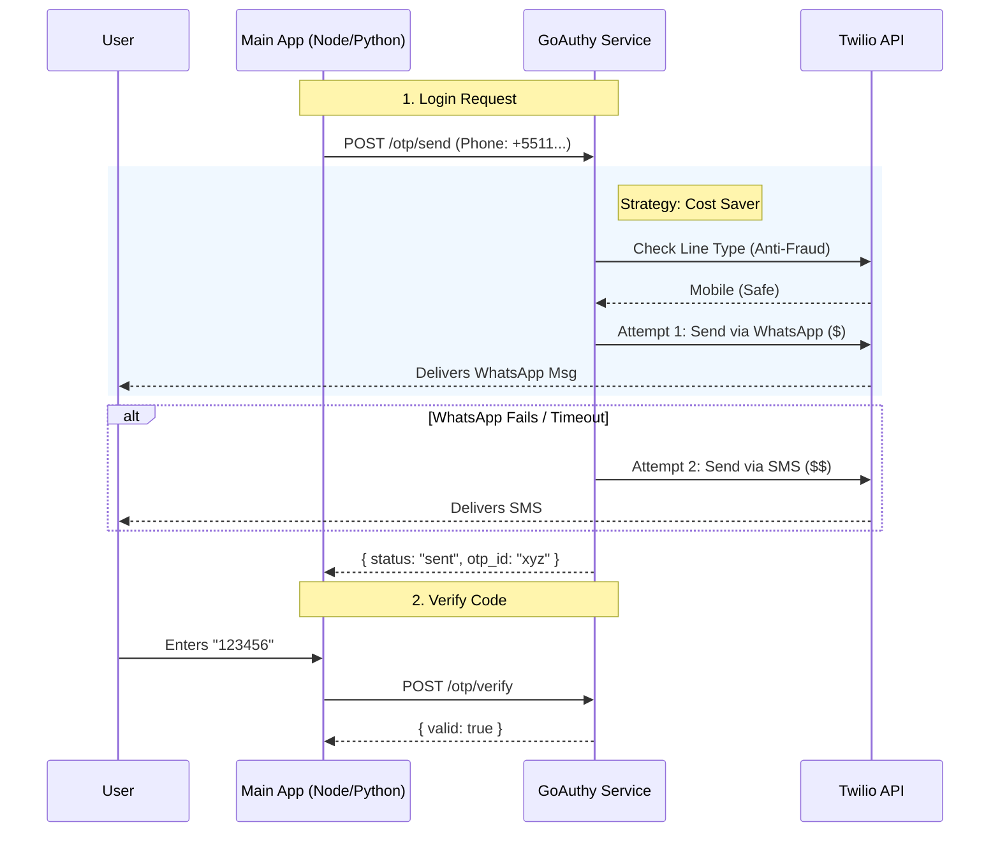

# GoAuthy 🛡️

> **The "Smart" 2FA Sidecar for Developers.**
> Stop rewriting authentication logic. Drop GoAuthy into your Docker Compose and get an intelligent, cost-optimized, and fraud-resistant OTP microservice.

## 🧐 Why GoAuthy?

Implementing 2FA (Two-Factor Authentication) correctly is hard. Developers often face three nightmares:

1. **High Costs:** Sending global SMS is expensive.
2. **Low Conversion:** Users hate waiting for codes that never arrive.
3. **Fraud:** Bots draining your budget by triggering SMS to premium numbers.

**GoAuthy** is a standalone microservice written in **Go** that orchestrates this complexity for you. It sits next to your main application (Node.js, Python, Java, PHP) and handles the dirty work.

## ✨ Key Features

* **💸 Smart Cost Optimization (The "Waterfall" Strategy):**
GoAuthy attempts cheaper channels first. It tries **WhatsApp** → fails over to **SMS** → fails over to **Voice Call**. You save money on every successful authentication.
* **🛡️ Built-in Fraud Guard:**
Automatically queries the Twilio Lookup API to detect **VoIP/Landline numbers** and blocks them before sending an SMS. Prevent bot attacks and SIM Swap fraud.
* **🔌 Language Agnostic:**
Connect via REST API or gRPC. If your app speaks HTTP, it speaks GoAuthy.
* **⚙️ Hot-Reload Configuration:**
Change OTP templates, timeout rules, or fallback strategies via a `policy.yaml` file without restarting the container.
* **🐳 Docker First:**
Zero installation. Runs as a lightweight sidecar container (~15MB).

## 🧠 How it Works

GoAuthy acts as a middleware between your user and the Twilio Cloud.



## 🚀 Quick Start

You don't need to install Go. Just add GoAuthy to your `docker-compose.yml`.

### 1. Configure Services

```yaml
version: '3.8'
services:
  # Your Main Application
  my-backend:
    image: my-node-app
    environment:
      - GOAUTHY_URL=http://goauthy:8080

  # GoAuthy Sidecar
  goauthy:
    image: ghcr.io/emanuellcs/goauthy:latest
    ports:
      - "8080:8080"
    volumes:
      - ./policy.yaml:/app/policy.yaml
    environment:
      - TWILIO_ACCOUNT_SID=${TWILIO_ACCOUNT_SID}
      - TWILIO_AUTH_TOKEN=${TWILIO_AUTH_TOKEN}
      - TWILIO_SENDER_NUMBER=${TWILIO_PHONE}
      - REDIS_URL=redis://redis:6379
    depends_on:
      - redis

  redis:
    image: redis:alpine

```

### 2. Define Policy (`policy.yaml`)

Customize behavior without changing code.

```yaml
security:
  otp_length: 6
  otp_expiration: 300s

strategy:
  steps:
    - method: "whatsapp"
      timeout: 15s
    - method: "sms"
      timeout: 30s
    - method: "voice"
```

### 3. Run

```bash
docker-compose up -d
```

## 📡 API Reference

### Send OTP

`POST /v1/otp/send`

```json
{
  "to": "+5511999999999",
  "channel_preference": ["whatsapp", "sms"]
}
```

### Verify OTP

`POST /v1/otp/verify`

```json
{
  "otp_id": "uuid-returned-from-send",
  "code": "123456"
}
```

## 🤝 Contributing

Contributions are welcome! This project uses **Go 1.21+** and **Clean Architecture** principles.

1. Fork the Project
2. Create your Feature Branch (`git checkout -b feature/AmazingFeature`)
3. Commit your Changes (`git commit -m 'Add some AmazingFeature'`)
4. Push to the Branch (`git push origin feature/AmazingFeature`)
5. Open a Pull Request

## 📄 License

Distributed under the MIT License. See `LICENSE` for more information.

---

*Built with 💙 in Go*
